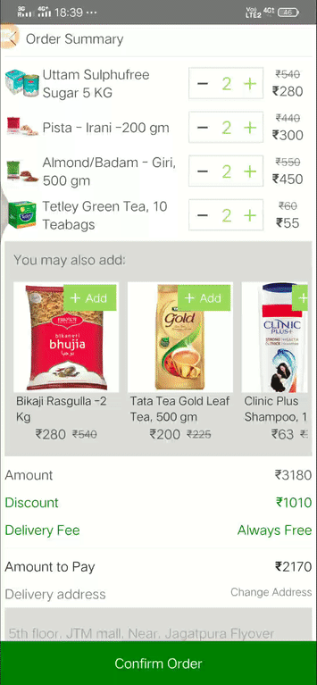

# Shopping Cart

A react-native shopping application with dummy order Summary and cart screen. {No API's, only offline Data}.


## What We Can Learn

- Navigation in react-native using react-navigation
- Horizontal Scrolling
- Locking the App to portrait Mode
- Deep Cloning the javascript Object
- Fixing a View to Bottom of the screen
- Multiple line TextInput
- Dividing The Component to small functional component
- Using Functional Components { stateless components}


#### Demo GIF



## Instruction to run the project

### Open Terminal

```bash
$ git clone git@github.com:rickyansari/shoppingCart.git
$ cd shoppingCart
```

Then, install the packages

```bash
$ yarn
```

> Or, if using npm:

```bash
$ npm install
```

Then, start the server

```bash
$ npx react-native start
```

### Open a new Terminal

Finally, builds your app and starts it on a connected Android emulator or device

```bash
$ npx react-native run-android
```
